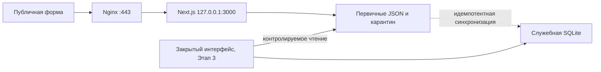

# Этап 2: архитектура закрытой системы персональных данных

Статус: архитектурный фундамент подготовлен локально. Административный интерфейс не введён в эксплуатацию, `PD_ADMIN_ENABLED=false`, production не изменён.

## Границы этапа

Публичные `POST /api/quote` и `POST /api/assistant/lead` продолжают сохранять первичные JSON независимо от SQLite. Новая база хранит только служебный индекс, авторизацию, ход обработки и журналы. Полные имя, телефон, e-mail, сообщение, диалог и файлы в `lead_index` не копируются.



## Состояние безопасности по умолчанию

- PM2 запускает `next start -H 127.0.0.1 -p 3000`.
- Nginx проксирует только на loopback.
- Маршруты `/internal/personal-data` и `/api/internal/personal-data` возвращают 404 в middleware при выключенном флаге и дополнительно закрыты Nginx на Этапе 2.
- Внутренние адреса исключены из sitemap и закрыты в robots; ответы получают `no-store` и `X-Robots-Tag`.
- `PD_ADMIN_ENABLED=false` не влияет на публичные формы.
- Для включения нужны отдельные секреты поиска, сессий и цепочки аудита. Они не хранятся в Git или SQLite.

## SQLite

Путь: `/var/lib/steelprodukt/admin/personal-data.sqlite`. Минимальная версия Node.js для встроенного `node:sqlite`: 22.13.0. Перед миграцией на VPS версия должна быть проверена вручную.

При открытии базы применяются:

- каталог `0700`, файлы SQLite/WAL/SHM `0600`;
- отказ от symlink и путей внутри `public` или `.next`;
- `PRAGMA journal_mode=WAL`;
- `PRAGMA foreign_keys=ON`;
- `PRAGMA busy_timeout=5000`;
- `PRAGMA synchronous=FULL`;
- последовательные транзакционные миграции с checksum в `schema_migrations`.

Таблицы сгруппированы так:

- доступ: `users`, `sessions`, `login_attempts`;
- заявки: `lead_index`, `lead_workflow`, `staff_comments`, `lead_operation_locks`;
- доказательства и контроль: `access_events`, `integrity_runs`;
- права субъектов: `subject_requests`, `subject_request_leads`, `legal_holds`;
- инциденты: `incidents`;
- выгрузки: `exports`, `export_items`, `export_downloads`;
- удаление: `deletion_jobs`, `deletion_records`;
- управление: `systems_registry`, `legal_document_versions`, `backup_runs`.

## Команды фундамента

Команды требуют серверного environment и ничего не включают автоматически:

```bash
npm run pd:migrate
npm run pd:migrate:status
npm run pd:sync-index -- --dry-run
npm run pd:integrity-check
npm run pd:audit-verify
npm run pd:create-admin
```

Создание первого администратора допускается только в интерактивном терминале после миграции. Пароль не принимается в аргументе командной строки, не печатается и создаётся с обязательной сменой при первом входе.

## Runbook закрытия порта 3000

Ни одна из этих команд не выполнена автоматически. Сначала оператор VPS должен подтвердить механизм firewall и окно обслуживания.

### 1. Предварительная фиксация

```bash
node --version
pm2 describe steelprodukt
pm2 env 0
sudo ss -lntp | grep ':3000'
sudo nginx -T
```

Не копировать секреты из `pm2 env` в отчёт. Требуется Node.js `>=22.13.0` только для будущей административной SQLite; публичный релиз с изменённым `engines` нельзя выполнять до проверки версии.

### 2. Определение firewall

Выполнять команды чтения по очереди и использовать только реально установленный механизм:

```bash
sudo ufw status verbose
sudo systemctl is-active nftables
sudo nft list ruleset
sudo iptables -S
```

Отдельно проверить Cloud Firewall в панели Beget. Не создавать одновременно конфликтующие правила в `ufw`, `nftables` и `iptables`.

### 3. Привязка приложения

После проверенного релиза `ecosystem.config.cjs` и только в согласованное окно:

```bash
cd /var/www/html
pm2 startOrReload ecosystem.config.cjs --env production --update-env
pm2 save
sudo ss -lntp | grep ':3000'
```

Ожидается только `127.0.0.1:3000`. Наличие `0.0.0.0:3000` или `[::]:3000` — блокер.

### 4. Второй уровень защиты

В активном firewall запретить входящие TCP-соединения на 3000 из внешних сетей. Разрешать внешний порт 3000 не требуется даже для мониторинга. Конкретную команду выбирает администратор после определения firewall и проверки действующих правил, чтобы не потерять SSH-доступ.

### 5. Проверка

На VPS:

```bash
curl -I http://127.0.0.1:3000/
curl -I https://www.steelprodukt.ru/
```

С отдельного внешнего узла:

```bash
curl -I --connect-timeout 5 http://31.129.103.48:3000/
```

Ожидается отказ или timeout для IP:3000 и штатный ответ сайта через HTTPS/Nginx. Дополнительно проверить форму без файла и с PDF. Только после подтверждения обход Nginx считается устранённым и `TRUST_NGINX_PROXY=true` допустим.

### 6. Rollback

Если публичный HTTPS перестал отвечать, вернуть предыдущую проверенную PM2-конфигурацию, выполнить `pm2 startOrReload ... --update-env`, проверить локальный upstream и Nginx. Не открывать `0.0.0.0:3000` как способ восстановления публичного сайта. Firewall-правило откатывается только после подтверждения, что приложение всё равно слушает loopback.

## Что остаётся для Этапа 3

- серверные страницы входа и кабинета;
- endpoints с обязательной серверной RBAC/CSRF/step-up проверкой;
- карточка заявки с маскированием;
- streaming вложений и UI предупреждения антивируса;
- worker выгрузки и удаление по утверждённому процессу;
- реальный backup и тест восстановления;
- ручная проверка VPS, firewall, прав, Node.js и расписаний;
- юридическое утверждение локальных актов и назначение ответственных.

## Источники правовой проверки

- [Федеральный закон № 152-ФЗ на официальном портале](https://ips.pravo.gov.ru/api/ips/legislation/document?baseid=None&hash=98490812b3409e2a8d78a11ca9010f434ea3d9250a11dbbdb78690cd5551bdd6)
- [Информация Роскомнадзора для операторов — юридических лиц](https://82.rkn.gov.ru/directions/pers/p15375/)

Документ описывает техническую архитектуру и не заменяет правовое заключение российского юриста и решения ответственного за организацию обработки персональных данных.
